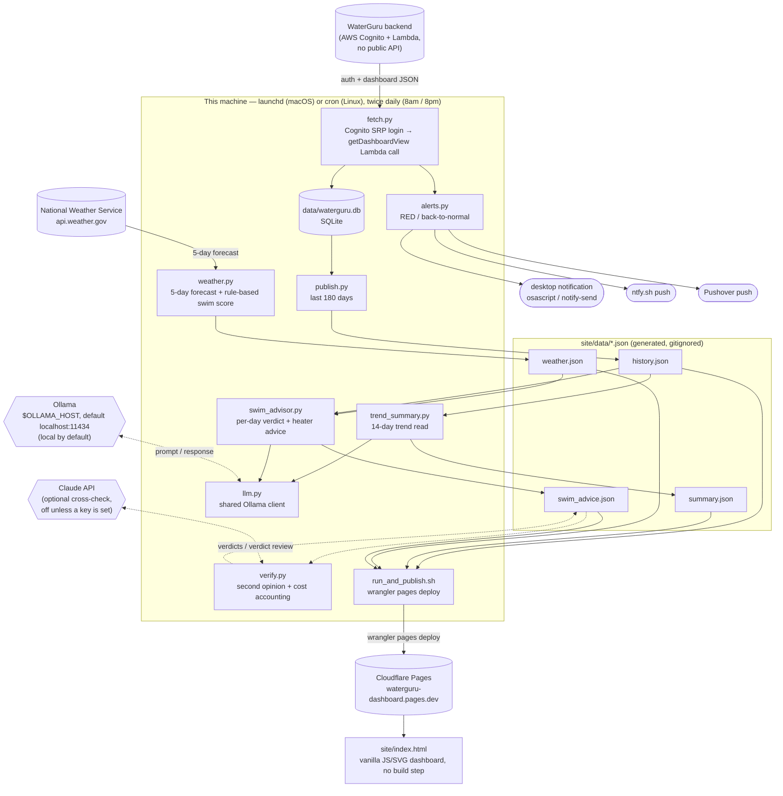

# WaterGuru Dashboard

A pipeline that pulls pool telemetry from a [WaterGuru Sense](https://waterguru.com/)
device — an internet-connected chlorine/pH/temp sensor most people only see through
WaterGuru's mobile app — stores it, and publishes it to a small static dashboard.
Twice a day it also asks a **local LLM** for a plain-English trend read and a
day-by-day swim/heater recommendation, using a real weather forecast.

**Live example:** https://waterguru-dashboard.pages.dev

**Repo:** https://github.com/billford/waterguru-dashboard (public)

---

## What it does

- **Pulls pool readings** twice a day (free chlorine, pH, water temp, skimmer flow,
  equipment health) straight from WaterGuru's backend — no official public API,
  see [Credit](#credit) below.
- **Stores history** in SQLite and charts it (chlorine, pH, temp) with target bands,
  hover tooltips, and a 7/30/90/all date filter.
- **Alerts** — a desktop notification and a phone push (via
  [ntfy.sh](https://ntfy.sh) and/or [Pushover](https://pushover.net)) whenever
  status goes RED, and again when it recovers back to normal.
- **Trend summary** — a local LLM reads the last 14 days of readings and writes
  2-3 plain-English sentences on whether things are trending up, down, or steady.
- **5-day swim forecast** — pulled from the National Weather Service, with a local
  LLM judging each day (great/good/marginal/poor) by weighing the forecast against
  the season and the pool's actual current water temp, plus a **heater lead-time
  tip** (the pool is heated, so a cool or warm stretch a few days out is worth
  adjusting for in advance).
- **A swim drill of the day** and a **shark-chase animation** on rough days, because
  a pool dashboard doesn't have to be boring.

All of it runs locally, twice a day — `launchd` on macOS or plain `cron` on Linux —
and republishes the static dashboard to Cloudflare Pages after every run. Nothing
paid, no backend server, no database server — just a scheduled job, a SQLite file,
and a static site.

---

## Architecture



Every arrow into `site/data/*.json` happens locally; the only outbound calls per
run are to WaterGuru, the National Weather Service, ntfy.sh and/or Pushover (if
configured), and finally Cloudflare when publishing. The Ollama call never leaves
the machine by default — it runs on `localhost:11434` unless you deliberately
point `OLLAMA_HOST` at another box on your LAN.

The two dotted paths are both opt-in and both off unless you configure them. The
Claude cross-check is the one step that sends pool data off your network, and
only the forecast plus the model's own verdicts — no chemistry history, no
credentials. It does nothing at all without an `ANTHROPIC_API_KEY`.

---

## Credit

The hard part — figuring out that WaterGuru's app talks to an AWS Cognito + Lambda
backend with no public API, and reverse-engineering the auth flow (SRP login,
identity-pool credential exchange, signed Lambda invocation) — was done by
[**Brian Wilson**](https://github.com/bdwilson) in
[bdwilson/waterguru-api](https://github.com/bdwilson/waterguru-api). `fetch.py` here
is a from-scratch rewrite of that same auth flow (no Flask/Docker, and using
[`pycognito`](https://github.com/pvizeli/pycognito) instead of the unmaintained
`warrant` library, which doesn't run on modern Python), but the credit for
discovering the API in the first place goes to that project. If you don't own a
WaterGuru, Brian's README has a referral discount link for one.

**Please don't hit the WaterGuru API more than once or twice a day.** There's no
token refresh implemented (same caveat as the original project) — every run is a
fresh login, and the API isn't meant for polling more often than that.

---

## Repo layout

```
fetch.py                     # Cognito auth + Lambda call → SQLite → triggers everything below
db.py                        # SQLite schema + row parsing
publish.py                   # SQLite → site/data/history.json
weather.py                   # NWS forecast → site/data/weather.json (+ rule-based swim score)
llm.py                       # shared Ollama client — model/host come from .env
verify.py                    # optional Claude API cross-check of the swim verdicts
trend_summary.py             # local LLM → site/data/summary.json
swim_advisor.py              # local LLM → site/data/swim_advice.json
alerts.py                    # desktop notification + ntfy.sh / Pushover on RED / recovery
envfile.py                   # .env loader, shared by every entrypoint
bench_models.py              # time candidate models on this project's real prompts
run_and_publish.sh           # fetch.py, then `wrangler pages deploy` (cron- and launchd-safe)
com.billfordx.waterguru-fetch.plist   # launchd schedule (8am/8pm), macOS
crontab.example              # cron schedule (8am/8pm), Linux
site/
  index.html                 # the dashboard — vanilla JS/SVG, no build step, no CDN deps
  about-ai.html              # what each LLM sees and what happens when it's unavailable
  data/                      # generated JSON the dashboard fetches client-side (gitignored)
.env.example                 # template for credentials, alert channels, and model choice
```

---

## Setup

```bash
python3 -m venv venv && ./venv/bin/pip install requests requests_aws4auth boto3 pycognito anthropic && cp -n .env.example .env
```

Then fill in `WG_USER` / `WG_PASS` in `.env`, and run the first fetch:

```bash
./venv/bin/python fetch.py
```

`anthropic` is optional — it's only needed for the Claude cross-check described
below; drop it from the install line if you don't want it. `cp -n` won't clobber
an existing `.env`.

`.env`:

```
WG_USER=your@email.address
WG_PASS=your_waterguru_password
WX_LAT=
WX_LON=

NTFY_TOPIC=
PUSHOVER_USER_KEY=
PUSHOVER_API_TOKEN=

OLLAMA_HOST=http://localhost:11434
WG_TREND_MODEL=llama3.2:3b
WG_ADVISOR_MODEL=gemma3:12b
```

| | |
|---|---|
| `WG_USER` / `WG_PASS` | Same login as the WaterGuru mobile app. The only required values. |
| `WX_LAT` / `WX_LON` | For the 5-day swim forecast (US only). |
| `NTFY_TOPIC`, `PUSHOVER_*` | Alert channels — see [Alerting](#alerting). |
| `OLLAMA_HOST`, `WG_*_MODEL` | Local LLM host and model choice — see [Local LLM](#local-llm-ollama). |

Everything past `WG_PASS` is optional — each feature turns itself off if its
settings are missing. See `.env.example` for the full annotated list.

Inline `# comments` after a value are stripped, so `WG_TREND_MODEL=gemma3:4b  # faster`
does the right thing. Quote the value if it genuinely contains ` #`.

`.env` is gitignored — never commit it. So is `data/waterguru.db` and everything
under `site/data/` except `.gitkeep` (all generated, regenerated on every run). The
repo's git history has been audited and contains no real credentials — only the
`.env.example` placeholders were ever committed.

### Local LLM (Ollama)

Both the trend summary and the swim advisor call [Ollama](https://ollama.com).
Neither is required — if Ollama isn't reachable or the model returns something
that doesn't validate, `trend_summary.py` falls back to a rule-based sentence and
`swim_advisor.py` falls back to `weather.py`'s point-based scoring, so the
dashboard still renders.

```bash
for m in llama3.2:3b gemma3:12b; do ollama pull "$m"; done && ollama list
```

`llama3.2:3b` handles the trend summary — small and fast, plenty for summarizing
numbers. `gemma3:12b` handles the swim advisor, which needs more judgment; see
the sizing table below.

Which model does which job is configuration, not code:

```
OLLAMA_HOST=http://localhost:11434   # or another box on the LAN
WG_TREND_MODEL=llama3.2:3b
WG_ADVISOR_MODEL=gemma3:12b
WG_LLM_TIMEOUT=180                   # seconds before falling back to rule-based
```

The dashboard reports whichever model actually produced the text, so the
"How the AI works" page stays honest when you swap models.

#### Telling the advisor about your pool

Two settings shape what the swim advisor actually asks the model for, rather
than assuming a generic pool:

```
WG_POOL_HAS_HEATER=1
WG_POOL_CONTEXT=We mainly swim weekends (Sat/Sun). Comfort matters more to us than running the heater less.
```

- **`WG_POOL_HAS_HEATER=0`** if the pool has no heater. This isn't cosmetic —
  without it, the advisor always asks the model for heater-adjustment advice,
  even for equipment that doesn't exist. Setting it to `0` drops the heater
  question from the prompt entirely and forces `heater_advice` to `null` in
  `swim_advice.json` regardless of what the model says, so a model that
  free-associates about a heater anyway never reaches the dashboard. Day-by-day
  swim verdicts run exactly the same either way.
- **`WG_POOL_CONTEXT`** is free text folded into the prompt as-is — which days
  you actually swim, how often, what you'd rather optimize for. This is what
  lets the model reason about lead time relative to when you'll actually be in
  the water: a cold snap on a Tuesday you'll never swim matters far less than
  one that lands on the weekend. Without it, the advisor treats every day of
  the forecast as equally relevant, which isn't true for most households.

Both feed into `bench_models.py` too, so benchmarking exercises the exact prompt
shape your `.env` actually produces rather than a generic one that quietly
diverges from what runs in production.

One setting we deliberately did **not** add: a hemisphere/continent field.
`weather.py` is hardcoded to the National Weather Service (`api.weather.gov`),
which only covers the US — the forecast card (and therefore the whole advisor)
simply doesn't work outside the US today, regardless of any season-hint config.
Adding a continent setting would be configuration with nothing behind it; if a
non-US weather source gets added later, this is the natural place to revisit it.

#### Picking a model for your hardware

The swim advisor is the demanding job: it has to weigh season, water temp, rain,
and wind into a verdict *and* return a strict shape. That shape is now handed to
Ollama as a JSON Schema, so sampling is constrained to it (Ollama ≥ 0.5) — the
model *cannot* emit an invalid verdict or a malformed object. That takes "returns
valid JSON" off the table as a model differentiator (it's also why `gpt-oss:20b`
failed the original comparison: it was being asked for JSON in the prompt rather
than constrained to it). What's left to choose on is judgment quality and speed.

On Apple Silicon, generation speed is bounded by memory bandwidth, not by CPU —
roughly `bandwidth ÷ model size`, at ~70% efficiency in practice. The **base M4
Mac mini runs at 120 GB/s** (the 273 GB/s figure belongs to the M4 Pro, which
isn't offered in a 32 GB configuration — 32 GB means base M4). macOS also caps
what the GPU may hold at roughly 70-75% of unified memory, so a 32 GB machine has
about **21-24 GB of usable model budget**, not 32.

Estimates for a 32 GB / 120 GB/s M4 mini, Q4_K_M quantization:

| Model | Size | Est. speed | Advisor run | Verdict |
|---|---|---|---|---|
| `llama3.2:3b` | 2.0 GB | ~40 tok/s | ~5 s | Fine for the trend summary; weak judgment for the advisor |
| `gemma3:4b` | 3.3 GB | ~25 tok/s | ~8 s | Good trend model, better prose than llama3.2 |
| `gemma3:12b` | 8.1 GB | ~10-13 tok/s | ~15-25 s | **Best dense fit for the advisor** — real headroom, no eviction churn |
| `gemma3:27b` | 17.4 GB | ~5-6 tok/s | ~45-70 s | Fits, but uses most of the budget; nothing else stays resident |
| `qwen2.5:32b` | ~20 GB | ~4-5 tok/s | ~60-90 s | Fits only just, at the edge of the wired limit — expect swapping |

#### Mixture-of-experts models break this arithmetic (in your favor)

The table above assumes **dense** models, where every weight is read for every
token — which is why speed tracks file size so closely. A mixture-of-experts
model only reads its active experts per token, so the two numbers come apart:

| | Resident in RAM | Read per token | Est. speed @ 120 GB/s |
|---|---|---|---|
| `gemma3:12b` (dense) | 8.1 GB | ~8.1 GB | ~10-13 tok/s |
| `gemma3:27b` (dense) | 17.4 GB | ~17.4 GB | ~5-6 tok/s |
| a 26B-A4B MoE | ~15.4 GB | ~2-3 GB | ~25-35 tok/s |

An `NNB-A4B` tag conventionally means *N* billion total parameters with ~4B
active. **The full model still has to be resident** — any expert can fire on any
token, so the memory budget is governed by total size — but throughput is
governed by the active slice. That makes MoE unusually well matched to a
bandwidth-starved machine like the base M4: you spend the RAM you have plenty of
to buy back the bandwidth you don't.

Worth benchmarking rather than assuming — `bench_models.py`'s tok/s column tells
you immediately whether a given build behaves like its active or its total size.

Two practical consequences on a 32 GB machine:

- **`qwen2.5:32b` is a poor fit at 120 GB/s.** It very nearly fills the entire GPU
  budget on its own, so every run evicts whatever else was loaded, and it's the
  slowest option by a wide margin. The 30-45s figure from the original comparison
  is from a wider-bandwidth machine; on a base M4 expect meaningfully worse.
- **`gemma3:12b` leaves room to actually run multiple models.** At ~8 GB it sits
  alongside a 2-4 GB trend model with ~10 GB still free, so both stay resident
  between the two daily runs and neither reload costs anything.

If you want maximum quality per gigabyte, Google's quantization-aware-training
builds (`gemma3:12b-it-qat`, `gemma3:27b-it-qat`) retain close to bf16 quality at
roughly Q4 size and are a straight swap for the tags above.

#### Running several models at once

Ollama loads models on demand and keeps them resident for 5 minutes by default:

| Variable | Meaning | Default |
|---|---|---|
| `OLLAMA_MAX_LOADED_MODELS` | How many models may be resident at once | 3 |
| `OLLAMA_KEEP_ALIVE` | How long an idle model stays loaded | `5m` |
| `OLLAMA_NUM_PARALLEL` | Concurrent requests per model | auto |

Concurrency is bounded by that same 21-24 GB budget — Ollama will evict rather
than overcommit, so the arithmetic is just "do the sizes add up." `gemma3:12b` +
`llama3.2:3b` is ~10 GB and comfortable; `qwen2.5:32b` + anything is not.

That said, this pipeline runs **sequentially, twice a day**, so it never needs two
models in memory simultaneously — the only real cost of a large model is per-run
latency. The budget matters if you're also running something else against Ollama
(an editor assistant, Open WebUI) and don't want the pool job evicting it every
twelve hours.

If you want to raise the GPU cap on a 32 GB machine (leave at least 8 GB for
macOS — allocating everything will hang the machine):

```bash
sudo sysctl iogpu.wired_limit_mb=24576
```

That resets on reboot; `sudo sysctl iogpu.wired_limit_mb=0` restores the default
immediately.

#### Measuring instead of guessing

The numbers above are estimates. `bench_models.py` runs this project's *actual*
prompts against whatever you have pulled and reports wall time, tokens/sec, and
whether the advisor's output contract validated:

These are alternatives, not a sequence — pick the one you want:

Everything currently installed:

```bash
./venv/bin/python bench_models.py
```

Two candidates head to head, three runs each, advisor job only:

```bash
./venv/bin/python bench_models.py gemma3:12b gemma3:27b --job advisor --runs 3
```

Against a model host on another machine, so you benchmark from the box that will
actually be calling it:

```bash
OLLAMA_HOST=http://mac-mini.local:11434 ./venv/bin/python bench_models.py --job advisor --runs 3
```

Model names may come before or after the flags, and tags containing `/` or `:`
(such as a `hf.co/...` build) need no quoting. `--runs 3` repeats each model so
you can see whether its verdicts are consistent, not just plausible once.

It unloads each model before moving to the next, so timings are comparable and
peak memory stays at one model's worth.

#### Setting up the model host

Loading models onto the Mac that will serve them, once. Every block in this
section is comment-free so it can be pasted whole — macOS defaults to zsh, which
(unlike bash) does **not** treat `#` as a comment in an interactive shell, so a
pasted line with a trailing comment fails outright rather than ignoring it.

Each step below is a **single line**. That is deliberate: many markdown viewers
only put the first line of a fenced block inside the block and render the rest as
separate inline spans, so selecting the block copies one line and silently drops
the others. One line per step has nothing to lose.

```bash
brew install ollama && for m in gemma3:12b llama3.2:3b; do ollama pull "$m"; done && ollama list
```

(Or install from the `.dmg` at <https://ollama.com/download> instead of Homebrew.)
`gemma3:12b` is ~8.1 GB and serves the swim advisor; `llama3.2:3b` is ~2.0 GB and
serves the trend summary. Optional alternatives worth benchmarking against them:

```bash
for m in gemma3:27b gemma3:12b-it-qat gemma3:4b; do ollama pull "$m"; done && ollama list
```

`gemma3:27b` is ~17.4 GB — slower, more judgment. `gemma3:12b-it-qat` is Google's
quantization-aware build, near-bf16 quality at roughly Q4 size. `gemma3:4b` is
~3.3 GB and a better trend model than `llama3.2:3b`.

The trailing `ollama list` is the check that everything you asked for actually
arrived — compare its output against the names you passed rather than assuming a
silent success.

Pulls are resumable and cached under `~/.ollama/models`; `ollama rm <tag>` frees
the disk again. Nothing is loaded into memory until a request arrives.

To make it a login-time service that listens on the LAN rather than only on
localhost, and keeps both models resident between the twice-daily runs:

```bash
mkdir -p ~/Library/LaunchAgents
cat > ~/Library/LaunchAgents/com.ollama.serve.plist <<'PLIST'
<?xml version="1.0" encoding="UTF-8"?>
<!DOCTYPE plist PUBLIC "-//Apple//DTD PLIST 1.0//EN" "http://www.apple.com/DTDs/PropertyList-1.0.dtd">
<plist version="1.0">
<dict>
  <key>Label</key><string>com.ollama.serve</string>
  <key>ProgramArguments</key>
  <array><string>/opt/homebrew/bin/ollama</string><string>serve</string></array>
  <key>EnvironmentVariables</key>
  <dict>
    <key>OLLAMA_HOST</key><string>0.0.0.0:11434</string>
    <key>OLLAMA_KEEP_ALIVE</key><string>24h</string>
    <key>OLLAMA_MAX_LOADED_MODELS</key><string>2</string>
  </dict>
  <key>RunAtLoad</key><true/>
  <key>KeepAlive</key><true/>
</dict>
</plist>
PLIST
launchctl bootstrap gui/$(id -u) ~/Library/LaunchAgents/com.ollama.serve.plist
ps -o user,pid,command -p $(pgrep -f 'ollama serve')
curl -s localhost:11434/api/tags | head -c 200
```

> **Do not run any of that under `sudo`.** A LaunchAgent is meant to run as you.
> `sudo launchctl` targets the system domain instead and starts Ollama as
> **root**, which reads `/var/root/.ollama/models` rather than the `~/.ollama`
> your `ollama pull` wrote to. The server comes up healthy and serves an empty
> model list — so the pipeline quietly falls back to rule-based output with
> nothing obviously broken. `launchctl load` is also the deprecated spelling and
> is what emits the "Expecting a LaunchDaemons path" warning; `bootstrap` is the
> current one.

The `ps` line must show **your** username, and the `curl` must list the models
you pulled. An empty `{"models":[]}` means it's running as root — back it out and
retry without `sudo`:

```bash
sudo launchctl bootout system/com.ollama.serve; launchctl bootout gui/$(id -u)/com.ollama.serve; sudo pkill -f 'ollama serve'
```

Both `bootout` calls error harmlessly if nothing was loaded in that domain — the
`;` separators (rather than `&&`) are what let the line continue past them.
`launchctl` identifies a service by the `Label` **inside** the plist, not the
filename — if you rename the file, use the label in these commands, or read it
back with:

```bash
/usr/libexec/PlistBuddy -c 'Print :Label' ~/Library/LaunchAgents/com.ollama.serve.plist
```

If Homebrew put `ollama` somewhere other than `/opt/homebrew/bin` (Intel Macs use
`/usr/local/bin`), fix the path in the plist first — check with
`command -v ollama`.

### Surviving a reboot

A LaunchAgent runs only while you are logged into a GUI session. Reboot a
headless Mac with nobody logged in and Ollama never starts, so the next scheduled
run degrades silently. Two ways to fix that:

- **Enable automatic login** (System Settings → Users & Groups → Automatic login)
  and keep the agent. This is the well-trodden path for Ollama on a Mac, and the
  one assumed here.
- **Use a LaunchDaemon** in `/Library/LaunchDaemons` for true boot-start. That
  needs `UserName` set to your account *and* `OLLAMA_MODELS` pointed at your home
  directory, and there are recurring reports of Metal GPU access being unreliable
  from the system context — which would silently drop you to CPU inference and
  make a 12B model unusably slow. Verify `ollama ps` shows `100% GPU` before
  trusting it.

Either way, confirm with an actual reboot before scheduling against it:

```bash
sudo reboot
```

then, once it is back, from the machine that will be calling it:

```bash
curl -s http://mac-mini.local:11434/api/tags
```

`OLLAMA_KEEP_ALIVE=24h` matters for a twice-daily job: at the 5-minute default
every run reloads both models from disk first. With 10 GB of models against a
21-24 GB budget, keeping them resident costs nothing you need back.

> **`OLLAMA_HOST=0.0.0.0` has no authentication.** Anyone who can reach port
> 11434 can use your GPU and read your prompts. Only do this on a network you
> trust, and prefer a firewall rule, Tailscale, or an SSH tunnel
> (`ssh -N -L 11434:localhost:11434 you@mac-mini`) over exposing it broadly.
> Verify what's listening with `lsof -nP -iTCP:11434 | grep LISTEN`.

#### Splitting the job across two machines

Running the pipeline on a Linux box while the models live on a Mac is a
supported layout — the only thing that crosses the network is the Ollama call.
On the Linux side:

```
OLLAMA_HOST=http://mac-mini.local:11434
WG_ADVISOR_MODEL=gemma3:12b
WG_TREND_MODEL=llama3.2:3b
```

Check the link before wiring up cron — this is the failure that otherwise shows
up as a silent fall back to rule-based output twice a day:

```bash
curl -s http://mac-mini.local:11434/api/tags && OLLAMA_HOST=http://mac-mini.local:11434 ./venv/bin/python bench_models.py --job advisor
```

`bench_models.py` works across the network too, so you can benchmark the Mac's
models from the machine that will actually be calling them. Two things to watch:
the Mac must not sleep (`sudo pmset -a sleep 0 disablesleep 1`, or at minimum
`sudo pmset -a networkoversleep 1`), and if it's on Wi-Fi the ~8 GB model load
happens on the Mac's own disk, so only the prompt and response cross the
network — bandwidth is a non-issue, but a dropped link isn't.

---

## Verifying the AI output (optional, Claude API)

The local model does a judgment task with no ground truth. Constrained decoding
guarantees the *shape* of its answer; nothing guarantees the *quality*. If you
want a check on that, `verify.py` sends the forecast, the water temp, and the
local model's verdicts to the Claude API and asks whether the calls hold up.

It is entirely opt-in. With no `ANTHROPIC_API_KEY` set, nothing runs and nothing
leaves the machine that didn't already. If it fails for any reason — no key, API
error, refusal, unparseable response — the published advice is untouched.

```
ANTHROPIC_API_KEY=sk-ant-...
WG_VERIFY_MODE=audit          # audit | correct | off
WG_VERIFY_MODEL=claude-opus-5
WG_VERIFY_EFFORT=low          # low | medium | high | xhigh | max
```

- **`audit`** (default) records agreement and disagreement but publishes the
  local model's calls unchanged. This is the mode that answers "is the data
  valid" — run it for a week and read the disagreement log.
- **`correct`** lets Claude's corrections overwrite the local verdicts.

### What it costs

The prompt is small — a 5-day forecast, five verdicts, and the heater
paragraph — so a run is roughly 800 input and 450 output tokens:

| Model | Per run | Per year (2×/day) |
|---|---|---|
| `claude-haiku-4-5` | $0.003 | ~$2 |
| `claude-sonnet-5` | $0.009 | ~$7 |
| `claude-opus-5` (default) | $0.015 | ~$11 |

Those are computed from list prices, but you don't have to trust them: **every
run records its actual token usage and dollar cost** in `swim_advice.json` and
prints it in the log, so the real number is always in front of you.

```json
"verification": {
  "model": "claude-opus-5",
  "checked": 5,
  "disagreements": [
    {"date": "2026-08-06", "was": "poor", "suggested": "marginal",
     "issue": "storms clear by midday; the afternoon is swimmable"}
  ],
  "usage": {"input_tokens": 812, "output_tokens": 447},
  "cost_usd": 0.015235
}
```

Two notes on the cost, since both are easy to get wrong:

- **`WG_VERIFY_EFFORT` is the real lever, not the model.** Thinking tokens bill
  as output, so effort moves the bill more than the model choice does on a task
  this small. It defaults to `low` because checking five weather verdicts is not
  a hard reasoning problem — raise it if the checks read as shallow.
- **Prompt caching won't help here.** The minimum cacheable prefix is 512-1024
  tokens depending on model, the shared part of this prompt is under that, and
  runs are twelve hours apart — far outside the 5-minute (or even 1-hour) cache
  TTL. Enabling it would only add the ~1.25× write premium.

The dashboard shows the result: a verdict that survived review reads
"cross-checked by claude-opus-5, no disagreements" rather than looking identical
to one nobody checked.

---

## Scheduling (twice a day)

`run_and_publish.sh` runs a fetch (which triggers alerts, weather, trend summary,
and the swim advisor) and then deploys the updated dashboard to Cloudflare Pages.
It's safe to call from either scheduler: it resolves its own directory, finds its
own interpreter (`./venv/bin/python`, else `python3`), sets a usable `PATH`, and
takes a `flock` so two runs can't overlap.

```
WG_SKIP_DEPLOY=1   fetch and regenerate only, skip the Cloudflare deploy
WG_PYTHON=...      explicit interpreter
WG_LOG=...         append all output to a log file
```

### macOS (launchd)

```bash
launchctl load ~/Library/LaunchAgents/com.billfordx.waterguru-fetch.plist
```

`launchd` catches a missed run up on next wake, which matters if the machine was
asleep at the scheduled time — cron just skips it.

### Linux (cron)

```bash
git clone https://github.com/billford/waterguru-dashboard && cd waterguru-dashboard && python3 -m venv venv && ./venv/bin/pip install requests requests_aws4auth boto3 pycognito && cp -n .env.example .env
```

Edit `.env`, then confirm one manual run works before scheduling anything:

```bash
$EDITOR .env && ./run_and_publish.sh
```

Only once that succeeds, add the schedule — paste from `crontab.example`, fixing
the path:

```bash
crontab -e
```

`crontab.example` has the schedule ready to edit:

```cron
SHELL=/bin/bash
MAILTO=""
0 8,20 * * *  WG_LOG=/home/YOU/waterguru-dashboard/data/cron.log /home/YOU/waterguru-dashboard/run_and_publish.sh
```

Notes specific to running headless:

- **Desktop notifications self-disable.** On Linux the script uses `notify-send`,
  and only when there's a graphical session to send to — under cron on a server
  there isn't, so it's skipped silently. Configure Pushover or ntfy for alerts, or
  set `DESKTOP_NOTIFY=0` explicitly.
- **Credentials come from `.env`**, not the shell — cron has no profile to read.
- **The Cloudflare deploy needs Node.** If `npx` isn't installed the deploy step
  is skipped with a warning; set `WG_SKIP_DEPLOY=1` to make that intentional and
  serve `site/` yourself instead.
- **Ollama can live elsewhere.** A Linux box with no GPU can point
  `OLLAMA_HOST` at a Mac on the LAN — start Ollama there with
  `OLLAMA_HOST=0.0.0.0 ollama serve` so it listens beyond localhost. Only do this
  on a network you trust; Ollama has no authentication.
- **`sqlite3`, `flock`, and `python3` are the only system dependencies.**

---

## Alerting

Each channel is independent — configure any, all, or none in `.env`. Nothing here
is required for the dashboard to work.

- **Desktop notification** — `osascript` on macOS, `notify-send` on Linux. On by
  default; set `DESKTOP_NOTIFY=0` to turn it off, and it self-disables on Linux
  when there's no graphical session (i.e. under cron).
- **Push via [ntfy.sh](https://ntfy.sh)** — free, no account. Set `NTFY_TOPIC` in
  `.env` to any hard-to-guess string, then subscribe to that topic in the ntfy
  app. Anyone who knows the topic name can read the alerts (ntfy topics aren't
  access-controlled), so don't use something guessable.
- **Push via [Pushover](https://pushover.net)** — a one-time app purchase, but the
  topics are private to your account rather than guessable. Set both
  `PUSHOVER_USER_KEY` (from your Pushover dashboard) and `PUSHOVER_API_TOKEN`
  (create an application at [pushover.net/apps/build](https://pushover.net/apps/build)).
  Optional: `PUSHOVER_DEVICE` to target one device, `PUSHOVER_PRIORITY`
  (-2 silent … 1 high, the default … 2 requires acknowledgment), `PUSHOVER_SOUND`,
  and `PUSHOVER_RETRY`/`PUSHOVER_EXPIRE` for priority 2.

Send a test through every configured channel without waiting for a real alert:

```bash
./venv/bin/python alerts.py
```

Two things trigger an alert, each firing once on the transition (not on every
subsequent reading):

- **Water chemistry status** — RED, and again when it recovers back to normal.
  Never fires for `YELLOW`.
- **Cassette replacement** — WaterGuru reports its own `status`/`urgent` flag on
  the cassette (the consumable sensing pad), same as it does for water
  chemistry. When that flips to `RED`/urgent, you get a "replace the cassette"
  alert with the current %/days-left; a second alert fires once it's back to
  `GREEN` after replacement.

---

## Deploying the dashboard

A one-time browser auth, then create the project:

```bash
npx wrangler login && npx wrangler pages project create waterguru-dashboard --production-branch main
```

Every deploy after that is just a normal run:

```bash
./run_and_publish.sh
```

The dashboard reads `site/data/*.json` client-side — there's no backend, just
static files that get overwritten and redeployed on each fetch. Deployment is a
direct `wrangler pages deploy` (no GitHub↔Cloudflare app integration), which is
why the GitHub repo can be public while the deploy step still just needs a
Cloudflare account and API auth, nothing shared with GitHub.

**Note on privacy:** the `pages.dev` URL is unlisted but not access-controlled —
anyone with the link can see pool status and history. That's an accepted
trade-off here; Cloudflare Access can gate it behind a login if that changes.
