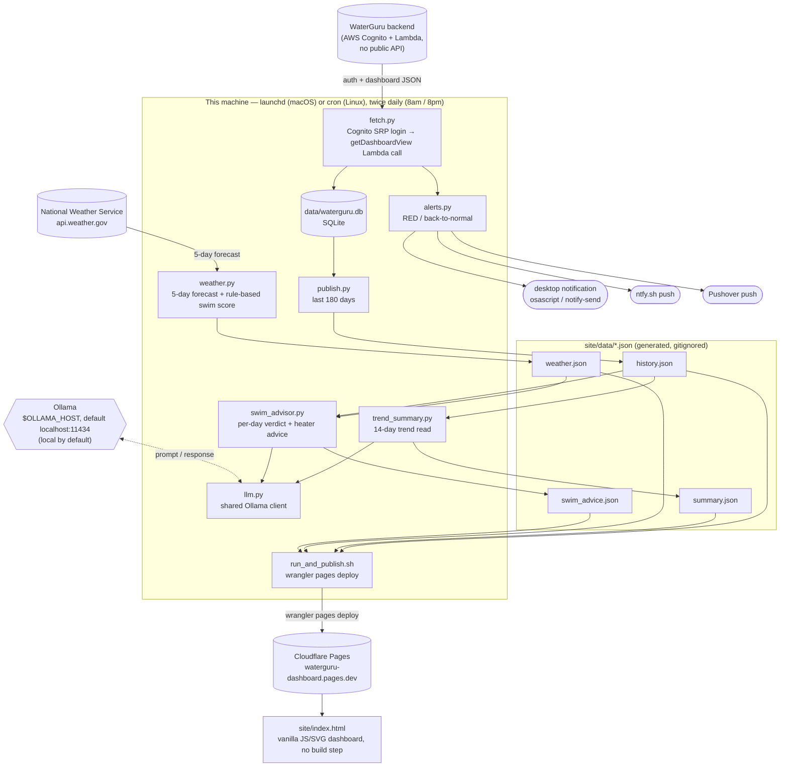

# WaterGuru Dashboard

A pipeline that pulls pool telemetry from a [WaterGuru Sense](https://waterguru.com/)
device — an internet-connected chlorine/pH/temp sensor most people only see through
WaterGuru's mobile app — stores it, and publishes it to a small static dashboard.
Twice a day it also asks a **local LLM** for a plain-English trend read and a
day-by-day swim/heater recommendation, using a real weather forecast.

**Live example:** https://waterguru-dashboard.pages.dev

**Repo:** https://github.com/billford/waterguru-dashboard (public)

---

## What it does

- **Pulls pool readings** twice a day (free chlorine, pH, water temp, skimmer flow,
  equipment health) straight from WaterGuru's backend — no official public API,
  see [Credit](#credit) below.
- **Stores history** in SQLite and charts it (chlorine, pH, temp) with target bands,
  hover tooltips, and a 7/30/90/all date filter.
- **Alerts** — a desktop notification and a phone push (via
  [ntfy.sh](https://ntfy.sh) and/or [Pushover](https://pushover.net)) whenever
  status goes RED, and again when it recovers back to normal.
- **Trend summary** — a local LLM reads the last 14 days of readings and writes
  2-3 plain-English sentences on whether things are trending up, down, or steady.
- **5-day swim forecast** — pulled from the National Weather Service, with a local
  LLM judging each day (great/good/marginal/poor) by weighing the forecast against
  the season and the pool's actual current water temp, plus a **heater lead-time
  tip** (the pool is heated, so a cool or warm stretch a few days out is worth
  adjusting for in advance).
- **A swim drill of the day** and a **shark-chase animation** on rough days, because
  a pool dashboard doesn't have to be boring.

All of it runs locally, twice a day — `launchd` on macOS or plain `cron` on Linux —
and republishes the static dashboard to Cloudflare Pages after every run. Nothing
paid, no backend server, no database server — just a scheduled job, a SQLite file,
and a static site.

---

## Architecture



Every arrow into `site/data/*.json` happens locally; the only outbound calls per
run are to WaterGuru, the National Weather Service, ntfy.sh and/or Pushover (if
configured), and finally Cloudflare when publishing. The LLM calls (dashed arrow)
never leave the machine by default — Ollama runs on `localhost:11434` unless you
deliberately point `OLLAMA_HOST` at another box on your LAN.

---

## Credit

The hard part — figuring out that WaterGuru's app talks to an AWS Cognito + Lambda
backend with no public API, and reverse-engineering the auth flow (SRP login,
identity-pool credential exchange, signed Lambda invocation) — was done by
[**Brian Wilson**](https://github.com/bdwilson) in
[bdwilson/waterguru-api](https://github.com/bdwilson/waterguru-api). `fetch.py` here
is a from-scratch rewrite of that same auth flow (no Flask/Docker, and using
[`pycognito`](https://github.com/pvizeli/pycognito) instead of the unmaintained
`warrant` library, which doesn't run on modern Python), but the credit for
discovering the API in the first place goes to that project. If you don't own a
WaterGuru, Brian's README has a referral discount link for one.

**Please don't hit the WaterGuru API more than once or twice a day.** There's no
token refresh implemented (same caveat as the original project) — every run is a
fresh login, and the API isn't meant for polling more often than that.

---

## Repo layout

```
fetch.py                     # Cognito auth + Lambda call → SQLite → triggers everything below
db.py                        # SQLite schema + row parsing
publish.py                   # SQLite → site/data/history.json
weather.py                   # NWS forecast → site/data/weather.json (+ rule-based swim score)
llm.py                       # shared Ollama client — model/host come from .env
trend_summary.py             # local LLM → site/data/summary.json
swim_advisor.py              # local LLM → site/data/swim_advice.json
alerts.py                    # desktop notification + ntfy.sh / Pushover on RED / recovery
envfile.py                   # .env loader, shared by every entrypoint
bench_models.py              # time candidate models on this project's real prompts
run_and_publish.sh           # fetch.py, then `wrangler pages deploy` (cron- and launchd-safe)
com.billfordx.waterguru-fetch.plist   # launchd schedule (8am/8pm), macOS
crontab.example              # cron schedule (8am/8pm), Linux
site/
  index.html                 # the dashboard — vanilla JS/SVG, no build step, no CDN deps
  about-ai.html              # what each LLM sees and what happens when it's unavailable
  data/                      # generated JSON the dashboard fetches client-side (gitignored)
.env.example                 # template for credentials, alert channels, and model choice
```

---

## Setup

```bash
python3 -m venv venv
./venv/bin/pip install requests requests_aws4auth boto3 pycognito
cp .env.example .env   # fill in WG_USER / WG_PASS (see below)
./venv/bin/python fetch.py
```

`.env`:

```
WG_USER=your@email.address       # same login as the WaterGuru mobile app
WG_PASS=your_waterguru_password
WX_LAT=                          # optional, for the 5-day swim forecast (US only)
WX_LON=

NTFY_TOPIC=                      # optional alert channel, see Alerting below
PUSHOVER_USER_KEY=               # optional alert channel, see Alerting below
PUSHOVER_API_TOKEN=

OLLAMA_HOST=http://localhost:11434   # optional, see Local LLM below
WG_TREND_MODEL=llama3.2:3b
WG_ADVISOR_MODEL=gemma3:12b
```

Everything past `WG_PASS` is optional — each feature turns itself off if its
settings are missing. See `.env.example` for the full annotated list.

`.env` is gitignored — never commit it. So is `data/waterguru.db` and everything
under `site/data/` except `.gitkeep` (all generated, regenerated on every run). The
repo's git history has been audited and contains no real credentials — only the
`.env.example` placeholders were ever committed.

### Local LLM (Ollama)

Both the trend summary and the swim advisor call [Ollama](https://ollama.com).
Neither is required — if Ollama isn't reachable or the model returns something
that doesn't validate, `trend_summary.py` falls back to a rule-based sentence and
`swim_advisor.py` falls back to `weather.py`'s point-based scoring, so the
dashboard still renders.

```bash
ollama pull llama3.2:3b     # trend summary — fast, small, plenty for summarizing numbers
ollama pull gemma3:12b      # swim advisor — needs more judgment, see below
```

Which model does which job is configuration, not code:

```
OLLAMA_HOST=http://localhost:11434   # or another box on the LAN
WG_TREND_MODEL=llama3.2:3b
WG_ADVISOR_MODEL=gemma3:12b
WG_LLM_TIMEOUT=180                   # seconds before falling back to rule-based
```

The dashboard reports whichever model actually produced the text, so the
"How the AI works" page stays honest when you swap models.

#### Picking a model for your hardware

The swim advisor is the demanding job: it has to weigh season, water temp, rain,
and wind into a verdict *and* return a strict shape. That shape is now handed to
Ollama as a JSON Schema, so sampling is constrained to it (Ollama ≥ 0.5) — the
model *cannot* emit an invalid verdict or a malformed object. That takes "returns
valid JSON" off the table as a model differentiator (it's also why `gpt-oss:20b`
failed the original comparison: it was being asked for JSON in the prompt rather
than constrained to it). What's left to choose on is judgment quality and speed.

On Apple Silicon, generation speed is bounded by memory bandwidth, not by CPU —
roughly `bandwidth ÷ model size`, at ~70% efficiency in practice. The **base M4
Mac mini runs at 120 GB/s** (the 273 GB/s figure belongs to the M4 Pro, which
isn't offered in a 32 GB configuration — 32 GB means base M4). macOS also caps
what the GPU may hold at roughly 70-75% of unified memory, so a 32 GB machine has
about **21-24 GB of usable model budget**, not 32.

Estimates for a 32 GB / 120 GB/s M4 mini, Q4_K_M quantization:

| Model | Size | Est. speed | Advisor run | Verdict |
|---|---|---|---|---|
| `llama3.2:3b` | 2.0 GB | ~40 tok/s | ~5 s | Fine for the trend summary; weak judgment for the advisor |
| `gemma3:4b` | 3.3 GB | ~25 tok/s | ~8 s | Good trend model, better prose than llama3.2 |
| `gemma3:12b` | 8.1 GB | ~10-13 tok/s | ~15-25 s | **Best fit for the advisor here** — real headroom, no eviction churn |
| `gemma3:27b` | 17 GB | ~5-6 tok/s | ~45-70 s | Fits, but uses most of the budget; nothing else stays resident |
| `qwen2.5:32b` | ~20 GB | ~4-5 tok/s | ~60-90 s | Fits only just, at the edge of the wired limit — expect swapping |

Two practical consequences on a 32 GB machine:

- **`qwen2.5:32b` is a poor fit at 120 GB/s.** It very nearly fills the entire GPU
  budget on its own, so every run evicts whatever else was loaded, and it's the
  slowest option by a wide margin. The 30-45s figure from the original comparison
  is from a wider-bandwidth machine; on a base M4 expect meaningfully worse.
- **`gemma3:12b` leaves room to actually run multiple models.** At ~8 GB it sits
  alongside a 2-4 GB trend model with ~10 GB still free, so both stay resident
  between the two daily runs and neither reload costs anything.

If you want maximum quality per gigabyte, Google's quantization-aware-training
builds (`gemma3:12b-it-qat`, `gemma3:27b-it-qat`) retain close to bf16 quality at
roughly Q4 size and are a straight swap for the tags above.

#### Running several models at once

Ollama loads models on demand and keeps them resident for 5 minutes by default:

```bash
OLLAMA_MAX_LOADED_MODELS=3    # how many may be resident at once
OLLAMA_KEEP_ALIVE=30m         # how long an idle model stays loaded
OLLAMA_NUM_PARALLEL=1         # concurrent requests per model
```

Concurrency is bounded by that same 21-24 GB budget — Ollama will evict rather
than overcommit, so the arithmetic is just "do the sizes add up." `gemma3:12b` +
`llama3.2:3b` is ~10 GB and comfortable; `qwen2.5:32b` + anything is not.

That said, this pipeline runs **sequentially, twice a day**, so it never needs two
models in memory simultaneously — the only real cost of a large model is per-run
latency. The budget matters if you're also running something else against Ollama
(an editor assistant, Open WebUI) and don't want the pool job evicting it every
twelve hours.

If you want to raise the GPU cap on a 32 GB machine (leave at least 8 GB for
macOS — allocating everything will hang the machine):

```bash
sudo sysctl iogpu.wired_limit_mb=24576   # resets on reboot; 0 restores the default
```

#### Measuring instead of guessing

The numbers above are estimates. `bench_models.py` runs this project's *actual*
prompts against whatever you have pulled and reports wall time, tokens/sec, and
whether the advisor's output contract validated:

```bash
./venv/bin/python bench_models.py                          # everything installed
./venv/bin/python bench_models.py gemma3:12b qwen2.5:32b   # head to head
./venv/bin/python bench_models.py --job advisor --runs 3   # consistency check
```

It unloads each model before moving to the next, so timings are comparable and
peak memory stays at one model's worth.

---

## Scheduling (twice a day)

`run_and_publish.sh` runs a fetch (which triggers alerts, weather, trend summary,
and the swim advisor) and then deploys the updated dashboard to Cloudflare Pages.
It's safe to call from either scheduler: it resolves its own directory, finds its
own interpreter (`./venv/bin/python`, else `python3`), sets a usable `PATH`, and
takes a `flock` so two runs can't overlap.

```
WG_SKIP_DEPLOY=1   fetch and regenerate only, skip the Cloudflare deploy
WG_PYTHON=...      explicit interpreter
WG_LOG=...         append all output to a log file
```

### macOS (launchd)

```bash
launchctl load ~/Library/LaunchAgents/com.billfordx.waterguru-fetch.plist
```

`launchd` catches a missed run up on next wake, which matters if the machine was
asleep at the scheduled time — cron just skips it.

### Linux (cron)

```bash
git clone https://github.com/billford/waterguru-dashboard && cd waterguru-dashboard
python3 -m venv venv
./venv/bin/pip install requests requests_aws4auth boto3 pycognito
cp .env.example .env && $EDITOR .env
./run_and_publish.sh          # confirm one manual run works first
crontab -e                    # then paste from crontab.example, fixing the path
```

`crontab.example` has the schedule ready to edit:

```cron
SHELL=/bin/bash
MAILTO=""
0 8,20 * * *  WG_LOG=/home/YOU/waterguru-dashboard/data/cron.log /home/YOU/waterguru-dashboard/run_and_publish.sh
```

Notes specific to running headless:

- **Desktop notifications self-disable.** On Linux the script uses `notify-send`,
  and only when there's a graphical session to send to — under cron on a server
  there isn't, so it's skipped silently. Configure Pushover or ntfy for alerts, or
  set `DESKTOP_NOTIFY=0` explicitly.
- **Credentials come from `.env`**, not the shell — cron has no profile to read.
- **The Cloudflare deploy needs Node.** If `npx` isn't installed the deploy step
  is skipped with a warning; set `WG_SKIP_DEPLOY=1` to make that intentional and
  serve `site/` yourself instead.
- **Ollama can live elsewhere.** A Linux box with no GPU can point
  `OLLAMA_HOST` at a Mac on the LAN — start Ollama there with
  `OLLAMA_HOST=0.0.0.0 ollama serve` so it listens beyond localhost. Only do this
  on a network you trust; Ollama has no authentication.
- **`sqlite3`, `flock`, and `python3` are the only system dependencies.**

---

## Alerting

Each channel is independent — configure any, all, or none in `.env`. Nothing here
is required for the dashboard to work.

- **Desktop notification** — `osascript` on macOS, `notify-send` on Linux. On by
  default; set `DESKTOP_NOTIFY=0` to turn it off, and it self-disables on Linux
  when there's no graphical session (i.e. under cron).
- **Push via [ntfy.sh](https://ntfy.sh)** — free, no account. Set `NTFY_TOPIC` in
  `.env` to any hard-to-guess string, then subscribe to that topic in the ntfy
  app. Anyone who knows the topic name can read the alerts (ntfy topics aren't
  access-controlled), so don't use something guessable.
- **Push via [Pushover](https://pushover.net)** — a one-time app purchase, but the
  topics are private to your account rather than guessable. Set both
  `PUSHOVER_USER_KEY` (from your Pushover dashboard) and `PUSHOVER_API_TOKEN`
  (create an application at [pushover.net/apps/build](https://pushover.net/apps/build)).
  Optional: `PUSHOVER_DEVICE` to target one device, `PUSHOVER_PRIORITY`
  (-2 silent … 1 high, the default … 2 requires acknowledgment), `PUSHOVER_SOUND`,
  and `PUSHOVER_RETRY`/`PUSHOVER_EXPIRE` for priority 2.

Send a test through every configured channel without waiting for a real alert:

```bash
./venv/bin/python alerts.py
```

Two things trigger an alert, each firing once on the transition (not on every
subsequent reading):

- **Water chemistry status** — RED, and again when it recovers back to normal.
  Never fires for `YELLOW`.
- **Cassette replacement** — WaterGuru reports its own `status`/`urgent` flag on
  the cassette (the consumable sensing pad), same as it does for water
  chemistry. When that flips to `RED`/urgent, you get a "replace the cassette"
  alert with the current %/days-left; a second alert fires once it's back to
  `GREEN` after replacement.

---

## Deploying the dashboard

```bash
npx wrangler login          # one-time browser auth
npx wrangler pages project create waterguru-dashboard --production-branch main
./run_and_publish.sh        # fetch + deploy
```

The dashboard reads `site/data/*.json` client-side — there's no backend, just
static files that get overwritten and redeployed on each fetch. Deployment is a
direct `wrangler pages deploy` (no GitHub↔Cloudflare app integration), which is
why the GitHub repo can be public while the deploy step still just needs a
Cloudflare account and API auth, nothing shared with GitHub.

**Note on privacy:** the `pages.dev` URL is unlisted but not access-controlled —
anyone with the link can see pool status and history. That's an accepted
trade-off here; Cloudflare Access can gate it behind a login if that changes.
